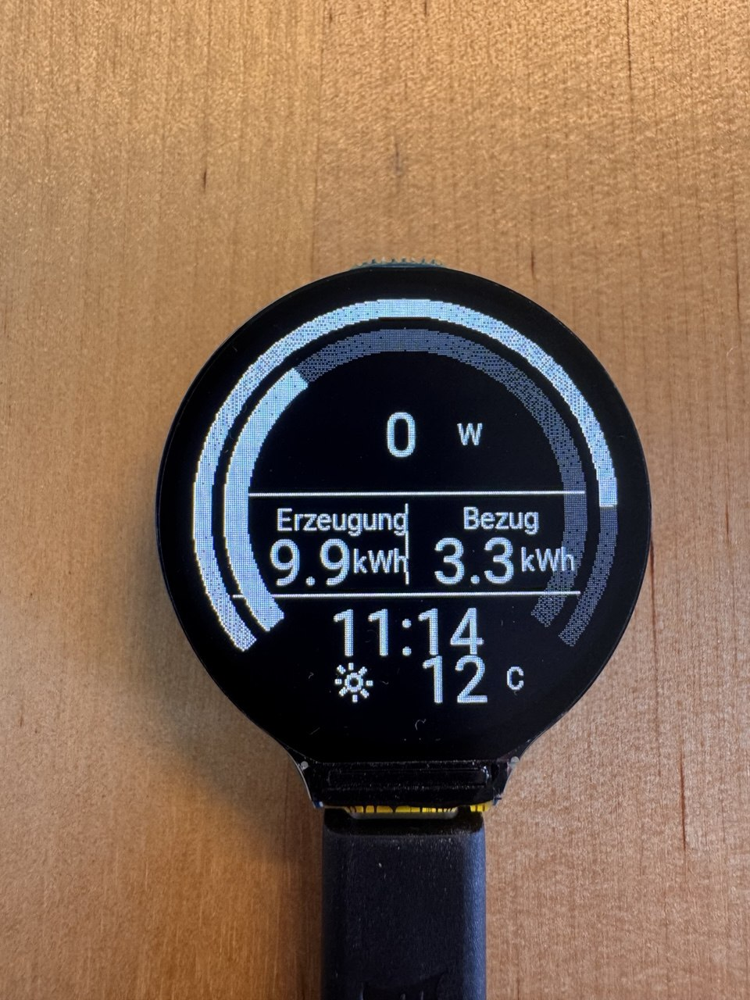

# ha-round-pv-weather-display

Round PV and weather display for the Waveshare ESP32-S3-LCD-1.28 using ESPHome and Home Assistant.

<br>
<a href="https://www.buymeacoffee.com/thoralf.brandt" target="_blank">
  
</a>
<br>



Round Display GUI

## Features

- outer ring: current PV power
- inner ring: battery state of charge
- center value: grid import/export with deadband
- lower area: daily generation and daily import
- clock and weather at the bottom
- white-on-black UI optimized for the round display

## Repository structure

- `esphome/pv-round-display.yaml` – ESPHome firmware
- `esphome/weather_*.png` – weather icons used by the display
- `home-assistant/configuration.yaml.snippet` – Open-Meteo sensors for Falkensee
- `home-assistant/packages/pv_round_display_package.yaml` – Home Assistant helper sensors used by the ESPHome device
- `.gitignore` – excludes secrets and local build output

## Home Assistant

### 1. Add the Open-Meteo sensors

Merge the contents of `home-assistant/configuration.yaml.snippet` into the main `configuration.yaml`.

### 2. Add the display package

Copy `home-assistant/packages/pv_round_display_package.yaml` into the Home Assistant `packages` directory.

If packages are not enabled yet, add this to `configuration.yaml`:

```yaml
homeassistant:
  packages: !include_dir_named packages
```

### 3. Adjust entity IDs

Open `home-assistant/packages/pv_round_display_package.yaml` and replace the placeholder source entities with the local entities:

- PV power sensor in W
- battery state of charge sensor in %
- daily PV generation sensor in kWh
- daily grid import sensor in kWh
- grid power sensor in W, where positive means import and negative means export

### 4. Restart Home Assistant

After restart, these helper entities should exist:

- `sensor.pv_display_pv_power_w`
- `sensor.pv_display_battery_soc`
- `sensor.pv_display_generation_today_kwh`
- `sensor.pv_display_consumption_today_kwh`
- `sensor.pv_display_grid_power_w`
- `sensor.open_meteo_falkensee_wetter`
- `sensor.open_meteo_falkensee_weathercode`

## ESPHome

### 1. Copy files

Copy all files from the `esphome/` folder into the ESPHome configuration directory.

### 2. Create secrets

Add these keys to `secrets.yaml`:

```yaml
wifi_ssid: "your-wifi-name"
wifi_password: "your-wifi-password"
fallback_password: "change-me"
```

### 3. Validate and install

Validate the YAML, then install it to the Waveshare ESP32-S3-LCD-1.28.

## Hardware

Designed for:

- Waveshare ESP32-S3-LCD-1.28
- display controller: GC9A01A
- backlight pin: GPIO40

## Notes

- Weather data comes from Open-Meteo.
- The firmware expects the weather helper sensors from Home Assistant.
- The PNG icons are transparent and optimized for use with `type: RGB` and `transparency: alpha_channel` in ESPHome.
